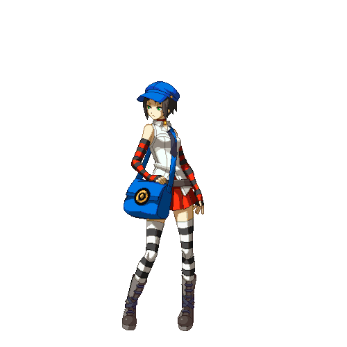

<h1 align="center">¡Hola! Soy Vicente Ruiz 👋</h1>

## Sobre mí:

- 🎓 Estudiante de quinto año de Ingeniería Civil en Computación e Informática, enfocado en tareas de Ingeniería de Software y desarrollo web.
- 🔭 Actualmente cursando un **Minor en Desarrollo y Arquitectura de Software**.
- 📍 Coquimbo, Chile (Disponibilidad remota).
- 💬 Inglés nivel intermedio - alto.
- 👤 Me interesa aprender a utilizar nuevas herramientas de forma continua y aumentar mi conocimiento en múltiples aspectos.
- 🎲 Como pasatiempos, disfruto de los videojuegos, escuchar música y ver series o anime.

## 🛠️ Stack técnológico

**Lenguajes**

**Frameworks y Librerías**

**Bases de datos**

**Herramientas & Despliegue**

## 🍃 Actualmente aprendiendo

## 🎯 Quiero aprender

## 🚀 Proyectos destacados

| Proyecto | Descripción | Tecnologías |
|---|---|---|
| **[Datademy](https://github.com/dazztyn/Datademy)** | Extrae información de formularios de Google y automatiza la interpretación de datos estadísticos y la generación de informes. | NestJS, React + Vite, React Native, MongoDB, Redis, JWT, Google Cloud, Google Workspace APIs |
| **[ProyectateUCN](https://github.com/dazztyn/ProyectateUCN)** | Generador de proyecciones semestrales de un alumno según su avance en la malla curricular hasta el semestre de egreso. | NestJS, PostgreSQL, React |
| **[Taller IoT — Sensores en tiempo real](https://github.com/dazztyn/Taller5BDNR)** | Lee datos de un sensor ESP32 y los muestra en tiempo real. | NestJS, React + Vite, Redis, MongoDB |

## 📫 Contacto

<!-- Agrega aquí tus badges: por ahora LinkedIn y, más adelante, tu portafolio -->

  
  
  <!--
    Otros badges que puedes copiar y pegar cuando los tengas listos:

    Correo:
    

    GitHub:
    

    Instagram:
    
  -->

